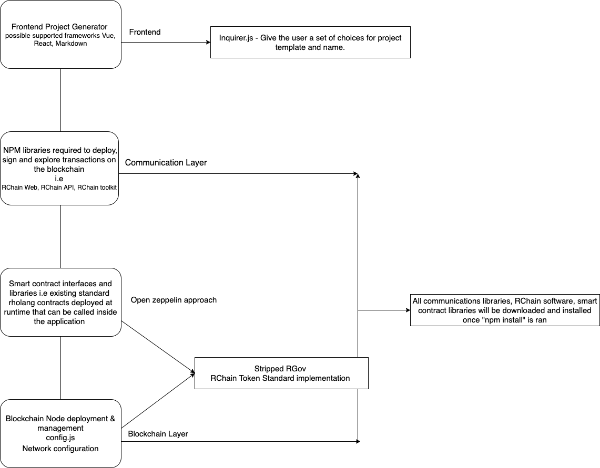

## RChain SDK Modular design

### Scope 
- RChain SDK is a framework for building dApps that consists of a library of modular, reusable and secure rholang smart contracts and corresponding front end templates.
- It includes a set of extensive CLI tools that provides a development environment to compile, deploy and test RChain dApps.
- Users can choose between different frameworks as frontend project generator.
- Smart contract interfaces and libraries.
- Node management - extensive configuration for running and managing nodes.
- RChain token standards implementation.

